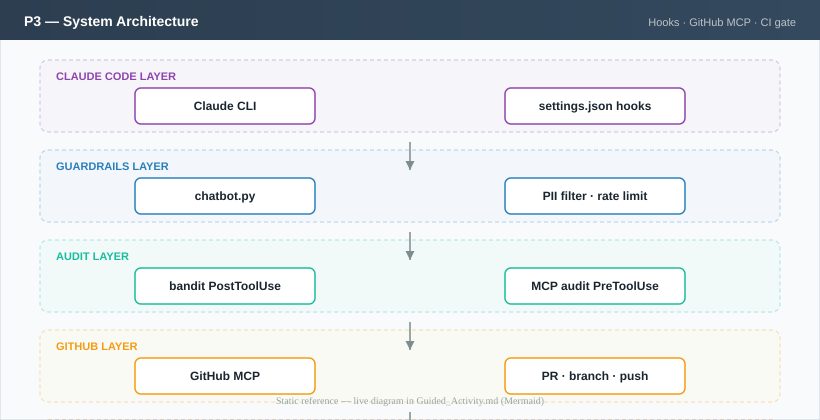

# Architecture reference — M6_P3_GitHub_CI_CD_Gate

> **Canonical location:** [`Guided_Activity.md` → Activity 0](../../Guided_Activity.md#activity-0-study-the-system-architecture)

This file is a copy for `workspace/lab_resources/diagrams/` after bootstrap. Edit **Guided_Activity.md** if you update architecture content.

